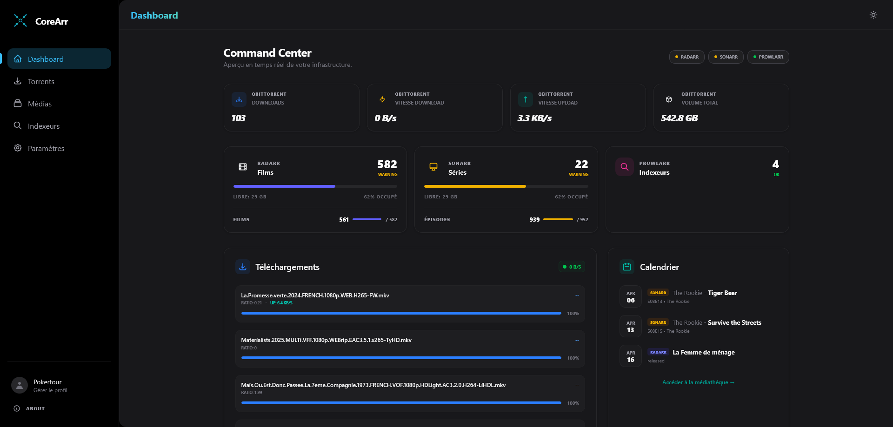
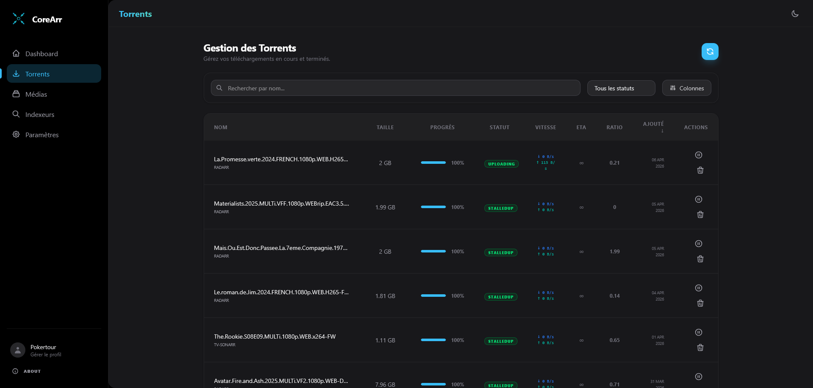
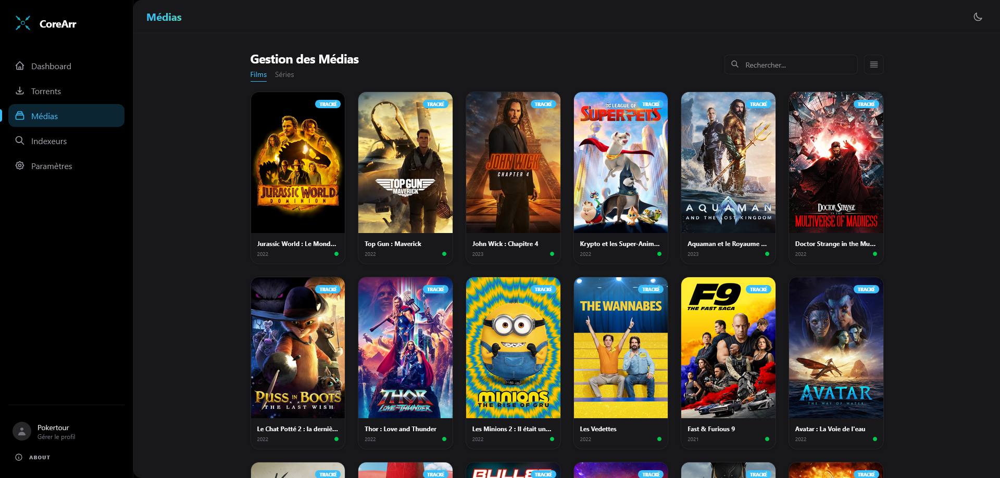
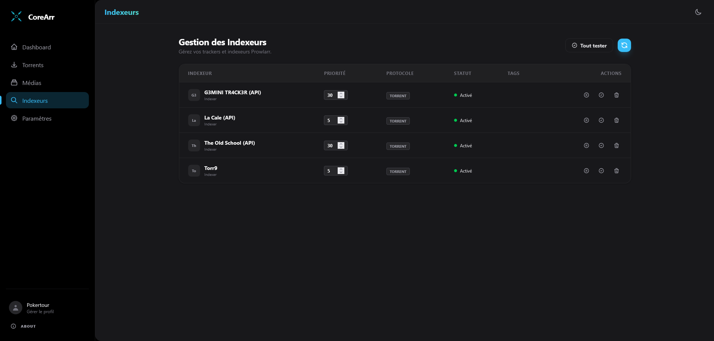

<div align="center">
  
  
  # CoreArr Management Suite
  
  **Une interface premium pour centraliser vos services média.**
  
  *A unified, modern, and high-performance dashboard for your "Arr" ecosystem.*
  
  [](https://laravel.com)
  [](https://php.net)
  [](https://tailwindcss.com)
  [](https://livewire.laravel.com)
  [](LICENSE)
</div>

<br />

## 🚀 Overview

**CoreArr** is a premium management suite designed to centralize and enhance your media automation experience. Built on the bleeding edge of the Laravel ecosystem, it provides a sleek, responsive, and unified interface for **Sonarr**, **Radarr**, **Prowlarr**, and your download clients.

Gone are the days of switching between multiple tabs. CoreArr brings everything into one beautiful view, optimized for both speed and aesthetics.

---

## ✨ Key Features

### 📊 Consolidated Dashboard
- **Aggregate Telemetry**: Real-time stats from Sonarr, Radarr, and qBittorrent in one place.
- **Unified Calendar**: See upcoming releases and air dates from all services in a single integrated timeline.
- **System Health**: Monitor the status of all your connected services at a glance.

### 🎬 Media Management
- **Unified Library**: Browse your entire movie and TV show library without leaving the app.
- **Deep Integration**: Full support for Sonarr/Radarr v3 API, including monitoring, downloading, and file management.
- **Smart History**: Track events and downloads across all your indexers.

### 📥 Real-time Torrent Control
- **qBittorrent Native**: Full control over your downloads (Pause, Resume, Delete).
- **v5.0+ Compatible**: Ready for the latest qBittorrent versions (Stop/Start API support).
- **Live Sync**: Real-time progress updates via Livewire.

### 🔍 Indexer Integration
- **Prowlarr Support**: Manage your indexers and test connectivity directly within CoreArr.
- **Interactive Search**: Search for releases and trigger downloads instantly.

---

## 🛠️ Technical Stack

CoreArr is built with the latest technologies to ensure maximum performance and maintainability:

- **Framework**: [Laravel 13](https://laravel.com)
- **Runtime**: [FrankenPHP](https://frankenphp.dev) with [Laravel Octane](https://laravel.com/docs/octane) for ultra-fast response times.
- **UI Components**: [Flux UI](https://fluxui.dev) & [Livewire 4](https://livewire.laravel.com) (Volt).
- **Styling**: [Tailwind CSS v4](https://tailwindcss.com) with a focus on modern "Glassmorphism" and dark mode aesthetics.
- **Testing**: [Pest PHP](https://pestphp.com).

---

## 🏗️ Installation

### 🐳 Docker Deployment (Recommended)

CoreArr is built for performance with **FrankenPHP** and **Laravel Octane**. The easiest way to deploy is using Docker and the provided `docker-compose.yml`.

#### 1. Setup with Docker Compose
The project includes a production-ready `docker-compose.yml` that handles both the application (mapped to port 8080) and a Redis instance for caching.

#### 2. Environment Configuration (.env)
```bash
# Create and enter the directory
mkdir corearr && cd corearr

# Download the configuration
wget https://raw.githubusercontent.com/pokertour/corearr/main/docker-compose.yml && wget https://raw.githubusercontent.com/pokertour/corearr/main/.env.example -O .env

mkdir database
touch database/database.sqlite
```

Your `.env` file must contain these essential variables:

- **`APP_KEY`**: Your application encryption key. You can generate one using [Laravel Key Generator](https://laravel-encryption-key-generator.vercel.app).
- **`APP_URL`**: The full URL where CoreArr is accessible (e.g., `https://corearr.yourdomain.com`).
- **SMTP (Optional)**: If you want to receive email notifications or use the "Forgot Password" feature:
  - `MAIL_MAILER=smtp`
  - `MAIL_HOST=smtp.gmail.com`
  - `MAIL_PORT=587`
  - `MAIL_USERNAME=your-email@gmail.com`
  - `MAIL_PASSWORD=your-app-password`
  - `MAIL_ENCRYPTION=tls`
  - `MAIL_FROM_ADDRESS="noreply@yourdomain.com"`
```bash
# Launch the stack
docker compose up -d
```
#### 3. Image Registry (GHCR)
A pre-built, optimized image is available on the **GitHub Container Registry**:

```yaml
image: ghcr.io/pokertour/corearr:latest
```

#### 4. Persistence
Make sure to map the following volumes to ensure your configuration and database are persistent:
- `./storage`: Application logs and cache.
- `./database/database.sqlite`: Your core database file.

---

## 📸 Screenshots

<div align="center">
  <p><b>Tableau de Bord & Activité</b></p>
  
  <br /><br />
  <p><b>Gestion des Téléchargements & Clients</b></p>
  
  <br /><br />
  <p><b>Bibliothèques de Médias & Indexeurs</b></p>
  <div style="display: flex; gap: 10px; justify-content: center;">
    
    
  </div>
</div>

---

## 📄 License
The CoreArr Management Suite is open-sourced software licensed under the [MIT license](LICENSE).

---

<div align="center">
  Developed with ❤️ by <b>Pokertour</b>
</div>
